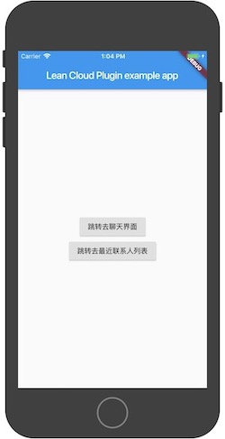
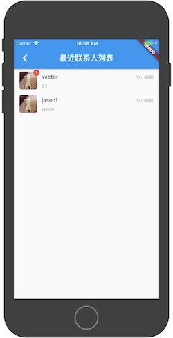
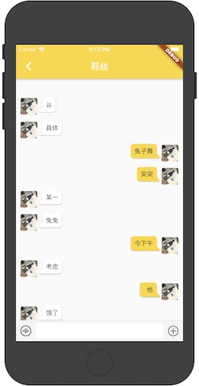

# flutter_lc_im

### Introduction
超级简单、轻量的Flutter聊天插件,支持ios和android两个平台。关键是免费！！！强势推荐一波LeanCloud！！! 这可能就是你要找的免费又好用的 flutter im。LeanCloud的使用[传送门](https://leancloud.cn/)。

### Important
全面升级flutter_lc_im,彻底剥离原生界面，让界面定制更容易！在0.2.5版本以前聊天界面还是用的原生代码，使得维护起来非常麻烦，尤其是对UI的修改，更是繁琐。为此，在1.0.0以后的版中去除原生界面的代码，使用flutter编写界面，让用户可以根据自己的业务绘制界面。同时example中已经提供了一套聊天UI，可以直接使用。目前还处于Beta版，还在升级中，如需更多功能请Star支持。

**框架地址：
[flutter_lc_im 1.0.0](https://pub.dev/packages/flutter_lc_im#-readme-tab-)**

### Support

* 	一对一聊天，暂时支持文字，图片不支持 
* 	获取聊天列表（可自定义列表UI）
* 	根据聊天情况刷新聊天列表 
* 	给出聊天列表上的未读消息数 

### Will supoort
* 	发送图片消息
* 	发送语音消息
* 	发送表情
* 	消息推送
* 	...... 

### Install
Add this to your package's pubspec.yaml file:

	dependencies:
		flutter_lc_im: ^1.0.0
		  
	flutter packages get

### Use：

#### 注册
    FlutterLcIm.register("appId","appKey", "api");
#### 登陆
    FlutterLcIm.login("clientId");
#### 获取聊天列表
    FlutterLcIm.queryHistoryConversations(_limit, _offset);  
#### 创建单聊
    FlutterLcIm.createConversation(currentUser.uid,toUser.uid);
#### 获取聊天记录
      FlutterLcIm.queryHistoryConversationMessages(）
#### 发送消息
       FlutterLcIm.sendMessage(text);   

### More
详细使用请看example中的代码
    
### QQ技术交流：
群聊号：853797155，欢迎交流问题和技术！

### 欢迎PR