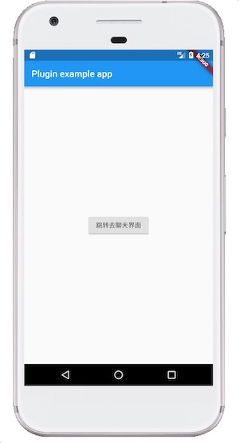

# flutter_lc_im

简单封装了LeanCloud的IM功能，给出了单聊和获取会话列表用户ID的功能。[flutter_lc_im 0.0.6](https://pub.dev/packages/flutter_lc_im#-readme-tab-)

Flutter中的实现如下：
		 
        FlutterLcIm.register("appId", "appKey","当前用户的userId");
        Map user = {'name':'jason1','user_id':"1",'avatar_url':"http://thirdqq.qlogo.cn/g?b=oidb&k=h22EA0NsicnjEqG4OEcqKyg&s=100"};
        Map peer = {'name':'jason2','user_id':"3",'avatar_url':"http://thirdqq.qlogo.cn/g?b=oidb&k=h22EA0NsicnjEqG4OEcqKyg&s=100"};
        FlutterLcIm.pushToConversationView(user,peer);
        FlutterLcIm.getConversationList()
        
FlutterLcIm.pushToConversationView中第一个参数user指的是当前用户，第二个参数peer是聊天对象.

#### 安装方式
Add this to your package's pubspec.yaml file:

	dependencies:
		flutter_lc_im: ^0.0.2
		  
	flutter packages get
## Getting Andriod Started
#### 第一步 AndroidManifest.xml加入以下配置
    <uses-permission android:name="android.permission.INTERNET" />
    <uses-permission android:name="android.permission.WRITE_EXTERNAL_STORAGE" />
    <uses-permission android:name="android.permission.ACCESS_NETWORK_STATE" />
    <uses-permission android:name="android.permission.ACCESS_WIFI_STATE" />
    <uses-permission android:name="android.permission.RECORD_AUDIO" />
    <uses-permission android:name="android.permission.RECORD_VIDEO" />
    <uses-permission android:name="android.permission.READ_LOGS" />
    <uses-permission android:name="android.permission.RECEIVE_BOOT_COMPLETED" />
    <uses-permission android:name="android.permission.VIBRATE" />
    
    <application
       android:theme="@style/LCIMKitTheme" >  //加入这个
		<activity
		xxxxxxxxx
		</activity>
	</application>
#### 第二步 Flutter项目中加入以下代码：
        FlutterLcIm.register("appId", "Appkey");
        FlutterLcIm.pushToConversationView(user,peer);

## Getting iOS Started

#### 第一步 info.plist加入以下配置
	<?xml version="1.0" encoding="UTF-8"?>
	<!DOCTYPE plist PUBLIC "-//Apple//DTD PLIST 1.0//EN" "http://www.apple.com/DTDs/PropertyList-1.0.dtd">
	<plist version="1.0">
	<dict>
		<key>NSAllowsArbitraryLoads</key>
		<true/>
	</dict>
	</plist>
	
	<?xml version="1.0" encoding="UTF-8"?>
	<!DOCTYPE plist PUBLIC "-//Apple//DTD PLIST 1.0//EN" "http://www.apple.com/DTDs/PropertyList-1.0.dtd">
	<plist version="1.0">
	<array>
		<string>fetch</string>
		<string>remote-notification</string>
	</array>
	</plist>
	
#### 第二步 AppDelegate.m中加入以下代码：

	#import <ChatKit/LCChatKit.h>
	#import <UserNotifications/UserNotifications.h>
	
	- (void)application:(UIApplication *)application didRegisterForRemoteNotificationsWithDeviceToken:(NSData *)deviceToken {
	    [AVOSCloud handleRemoteNotificationsWithDeviceToken:deviceToken];
	}
	
	- (void)application:(UIApplication *)application didReceiveRemoteNotification:(NSDictionary *)userInfo {
	    if (application.applicationState == UIApplicationStateActive) {
	    } else {
	
	        [[LCChatKit sharedInstance] didReceiveRemoteNotification:userInfo];
	    }
	}

	- (BOOL)application:(UIApplication *)app openURL:(NSURL *)url options:(NSDictionary<NSString *,id> *)options {
	    return YES;
	}
	
	- (BOOL)application:(UIApplication *)application openURL:(NSURL *)url sourceApplication:(NSString *)sourceApplication annotation:(id)annotation {
	    return YES;
	}

	/**
	 * Required for iOS 10+
	 * 在前台收到推送内容, 执行的方法
	 */
	- (void)userNotificationCenter:(UNUserNotificationCenter *)center
	       willPresentNotification:(UNNotification *)notification
	         withCompletionHandler:(void (^)(UNNotificationPresentationOptions))completionHandler {
	    NSDictionary *userInfo = notification.request.content.userInfo;
	    if([notification.request.trigger isKindOfClass:[UNPushNotificationTrigger class]]) {
	        //TODO:处理远程推送内容
	        NSLog(@"%@", userInfo);
	    }
	    // 需要执行这个方法，选择是否提醒用户，有 Badge、Sound、Alert 三种类型可以选择设置
	    completionHandler(UNNotificationPresentationOptionAlert);
	}

	/*!
	 * Required for iOS 7+
	 */
	- (void)application:(UIApplication *)application
	didReceiveRemoteNotification:(NSDictionary *)userInfo
	fetchCompletionHandler:(void (^)(UIBackgroundFetchResult))completionHandler {
	    //TODO:处理远程推送内容
	    NSLog(@"%@", userInfo);
	    // Must be called when finished
	    completionHandler(UIBackgroundFetchResultNewData);
	}
	
	#pragma mark - 实现注册APNs失败接口（可选）
	///=============================================================================
	/// @name 实现注册APNs失败接口（可选）
	///=============================================================================
	
	/**
	 * also used in iOS10
	 */
	- (void)application:(UIApplication *)application didFailToRegisterForRemoteNotificationsWithError:(NSError *)error {
	    NSLog(@"%s\n[无法注册远程提醒, 错误信息]\nline:%@\n-----\n%@\n\n", __func__, @(__LINE__), error);
	}

#### 第三步 Flutter项目中加入以下代码：
        FlutterLcIm.register("appId", "Appkey");
        FlutterLcIm.pushToConversationView(user,peer);
